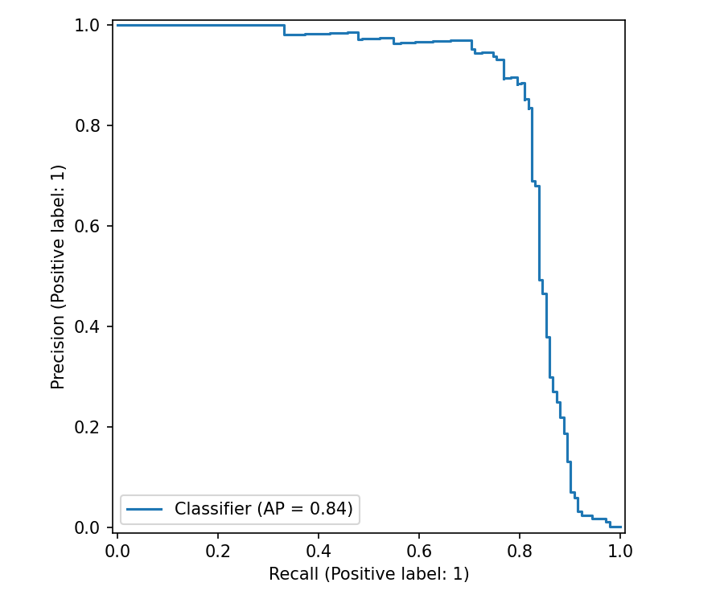
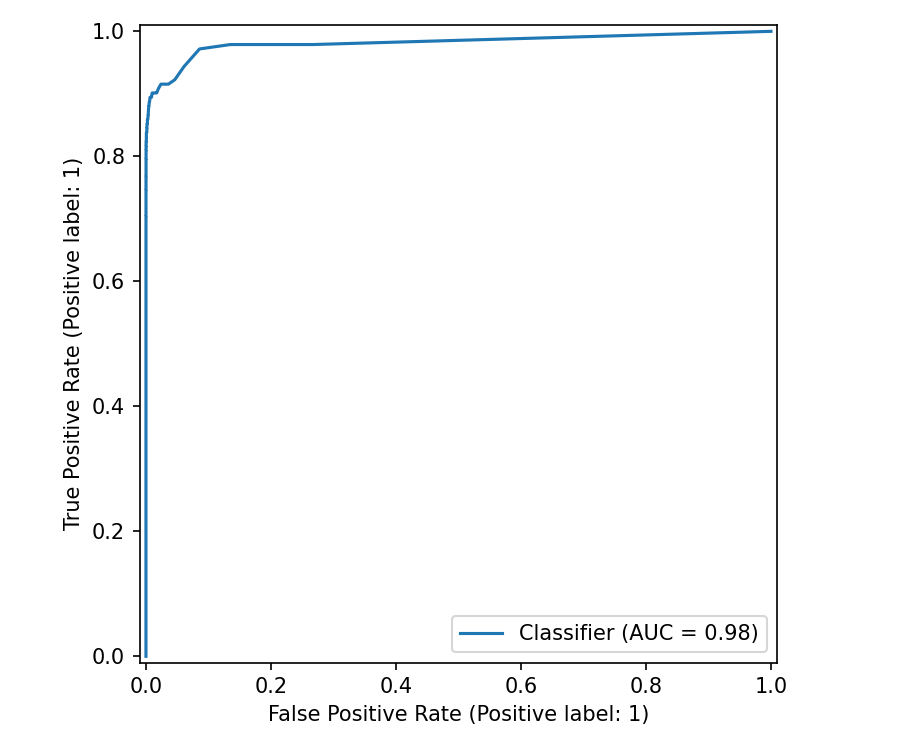
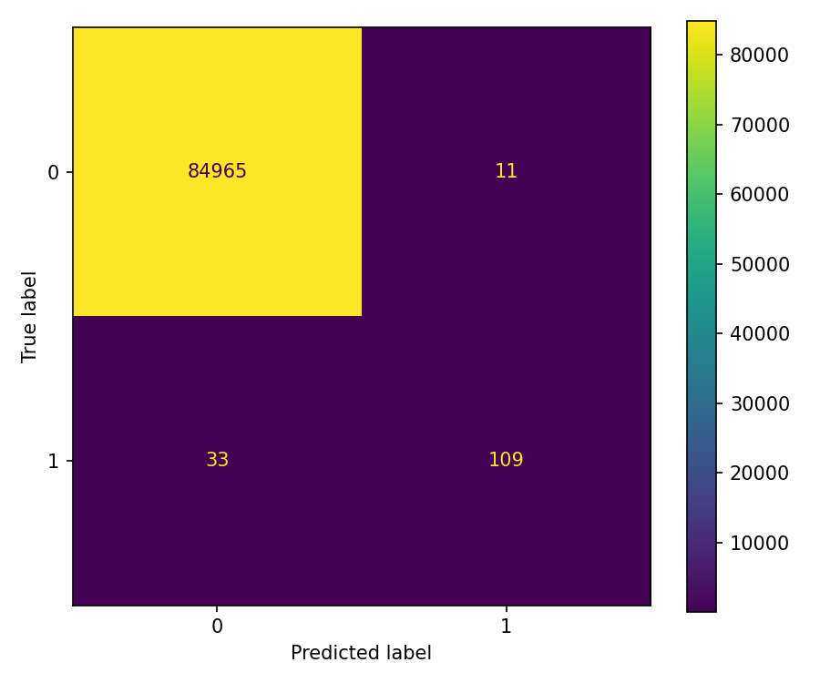

# Credit Card Fraud Detection

Leakage-safe, Hydra-configured machine learning pipeline for the Kaggle credit card fraud dataset.

The original work is preserved in `Notebooks/fraud.ipynb`. The project now moves the workflow into modular Python code with explicit data boundaries, DVC stages, and MLflow/DagsHub tracking.

## What This Project Does

- Downloads `mlg-ulb/creditcardfraud` from Kaggle only when raw data is missing.
- Splits data into train/test before feature engineering.
- Writes intermediate split data to `Data/intermediate`.
- Fits preprocessing on train only, then transforms train/test into `Data/final`.
- Trains configurable imbalanced-learning pipelines from Hydra config.
- Tracks train/CV/test metrics with MLflow.
- Promotes a new MLflow model version only when `test_pr_auc` beats current `champion`.
- Defines DVC stages for download, split, features, train, and evaluate.
- Serializes local Python objects as `.pkl`: `Artifacts/preprocessor.pkl` and `Models/model.pkl`.

## Project Layout

```text
Config/                 Hydra configs for paths, features, samplers, models, MLflow, DVC
Data/raw/               Raw Kaggle CSV
Data/intermediate/      Train/test split before feature engineering
Data/final/             Train/test snapshots after train-fitted feature engineering
Src/credit_fraud/       Modular pipeline package
Notebooks/              Original exploratory notebook
tests/                  Unit and smoke tests
dvc.yaml                Reproducible pipeline stages
main.py                 Hydra entrypoint
```

## Setup

```powershell
uv sync
Copy-Item .env.example .env
```

Fill `.env` with Kaggle and DagsHub credentials. `.env` is ignored by Git.

The default DagsHub targets are:

- MLflow: `https://dagshub.com/mahmoudelmalah85/imbalanced-creditcard-fraud-detection.mlflow`
- DVC: `https://dagshub.com/mahmoudelmalah85/imbalanced-creditcard-fraud-detection.dvc`

Configure DVC auth locally, not in committed files:

```powershell
.\.venv\Scripts\dvc.exe remote modify --local dagshub auth basic
.\.venv\Scripts\dvc.exe remote modify --local dagshub user $env:DAGSHUB_USERNAME
.\.venv\Scripts\dvc.exe remote modify --local dagshub password $env:DAGSHUB_TOKEN
```

## Run Pipeline

Run everything:

```powershell
python main.py stage=all
```

Run one stage:

```powershell
python main.py stage=download
python main.py stage=split
python main.py stage=features
python main.py stage=train
python main.py stage=evaluate
```

Run without MLflow, useful before credentials are set:

```powershell
python main.py stage=train mlflow.enabled=false
python main.py stage=evaluate mlflow.enabled=false
```

Use another sampler or model:

```powershell
python main.py stage=train sampler=borderline_smote model=random_forest
python main.py stage=train sampler=none model=logistic_regression
```

Use DVC:

```powershell
.\.venv\Scripts\dvc.exe repro
.\.venv\Scripts\dvc.exe push
```

`dvc repro` trains these isolated experiment variants and logs each one as a separate MLflow run:

```text
xgboost_smote
xgboost_borderline_smote
xgboost_none
lightgbm_smote
random_forest_smote
logistic_regression_none
```

Each variant writes to its own local paths:

```text
Models/experiments/<variant>/model.pkl
Reports/experiments/<variant>/
```

## Leakage Controls

- Raw data is never transformed before split.
- `Data/intermediate/train.csv` and `Data/intermediate/test.csv` are created before feature engineering.
- Feature transformer fits `RobustScaler` and optional KMeans only on train data.
- Model training uses an imblearn pipeline with feature engineering inside cross-validation.
- Samplers are pipeline training steps, so they are not applied during test prediction.
- Test metrics are computed once in `stage=evaluate` from untouched intermediate test data.
- Local fitted objects are serialized with Python pickle using `.pkl` paths.

## Current Defaults

- Champion metric: `test_pr_auc`
- Default model: XGBoost
- Default sampler: SMOTE
- Test size: 30%
- Duplicate handling: exact duplicate rows removed before split
- Rolling amount mean: disabled by default because random split makes production semantics ambiguous

## Results

The best completed experiment is `random_forest_smote`, promoted in MLflow as model version `4` under the `champion` alias. It was selected by `test_pr_auc`, the primary metric for this project.

The test set contains 85,118 transactions after duplicate removal:

- Legitimate transactions: 84,976
- Fraudulent transactions: 142

### Why PR-AUC Is the Champion Metric

This dataset is extremely imbalanced, so accuracy and ROC-AUC can look strong even when fraud detection is weak. PR-AUC focuses on the positive class by measuring precision-recall tradeoff across thresholds. That makes it better aligned with fraud detection, where the model must rank rare fraud cases highly without flooding the review queue with false positives.

ROC-AUC is still reported because it measures general ranking quality across both classes, but it is not the promotion metric. Fraud precision, fraud recall, fraud F1, and the confusion matrix are used to understand operating-threshold behavior.

### Experiment Comparison

| Experiment | Test PR-AUC | Test ROC-AUC | Fraud Precision | Fraud Recall | Fraud F1 | Macro F1 |
|---|---:|---:|---:|---:|---:|---:|
| `random_forest_smote` | **0.8352** | **0.9818** | 0.9083 | 0.7676 | **0.8321** | **0.9159** |
| `xgboost_none` | 0.8155 | 0.9737 | **0.9381** | 0.7465 | 0.8314 | 0.9156 |
| `xgboost_borderline_smote` | 0.8039 | 0.9604 | 0.7244 | 0.7958 | 0.7584 | 0.8790 |
| `xgboost_smote` | 0.7915 | 0.9701 | 0.2719 | 0.8521 | 0.4123 | 0.7051 |
| `lightgbm_smote` | 0.7860 | 0.9615 | 0.7887 | 0.7887 | 0.7887 | 0.8942 |
| `logistic_regression_none` | 0.6858 | 0.9619 | 0.0529 | **0.8873** | 0.0998 | 0.5431 |

### Champion Classification Report

`random_forest_smote` gives the strongest balance between fraud precision and recall. It catches 109 of 142 fraud cases while producing only 11 false positives.

| Class | Precision | Recall | F1-score | Support |
|---|---:|---:|---:|---:|
| Legitimate (`0`) | 0.9996 | 0.9999 | 0.9997 | 84,976 |
| Fraud (`1`) | 0.9083 | 0.7676 | 0.8321 | 142 |
| Macro avg | 0.9540 | 0.8837 | 0.9159 | 85,118 |
| Weighted avg | 0.9995 | 0.9995 | 0.9995 | 85,118 |

Confusion matrix:

|  | Predicted legitimate | Predicted fraud |
|---|---:|---:|
| Actual legitimate | 84,965 | 11 |
| Actual fraud | 33 | 109 |

### Champion Curves







## Verification

```powershell
python -m pytest -q
python -m ruff check main.py Src tests
```
